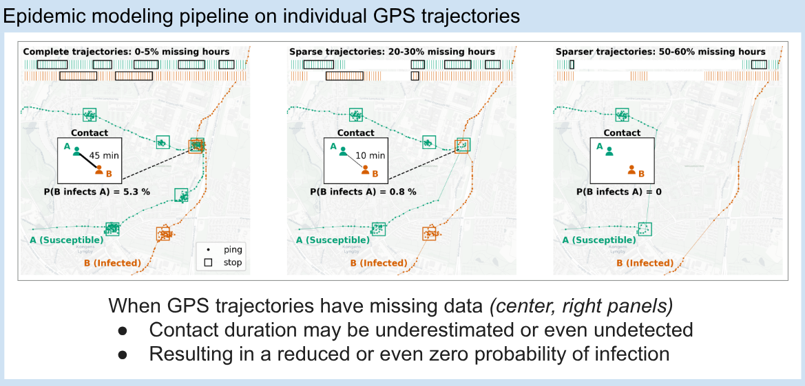
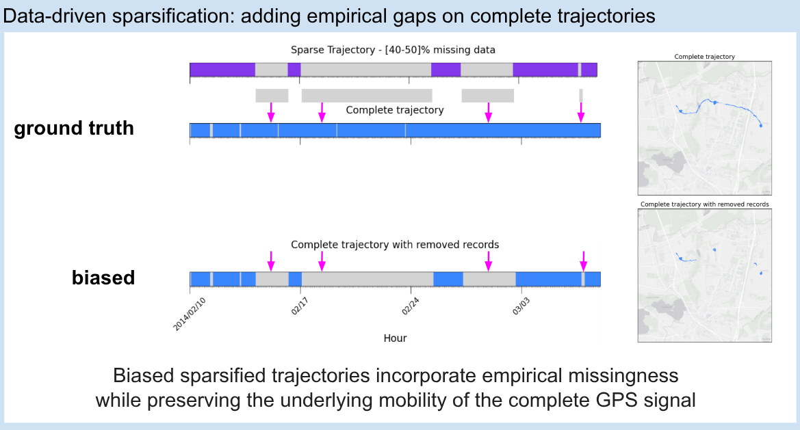
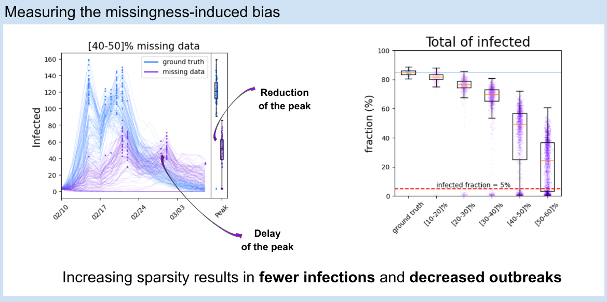
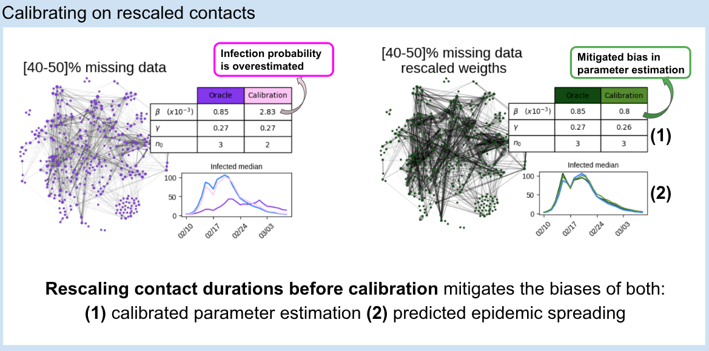

# Measuring and mitigating the bias introduced by using sparse GPS location data for epidemic modeling

**Context**

Large-scale GPS location data are increasingly used in epidemic modeling, especially for modeling the COVID-19 pandemic. However, this type of data typically exhibits high temporal sparsity, which potentially leads to bias in downstream analyses.

While this problem is widely recognized by researchers, there is limited quantitative evidence on the impact of such bias, especially due to the lack of a ground truth reference.

Moreover, to the best of our knowledge, there are no robust, validated frameworks for correcting the missingness-induced bias in epidemic predictions.

**Contribution**

The package Epidemic_modeling_on_sparse_GPS_trajectories introduces a framework to **measure and mitigate the missingness-induced bias in GPS location data**.

Here, we introduce a data-driven framework to measure the effect of GPS trajectory sparsity on epidemic predictions across different levels of data missingness, from 10–20% to 50–60% of missing hours over the study period. We then propose and evaluate a correction of the estimated contact durations before epidemic model calibration, which is shown to reduce bias and parameter misspecification.

This framework has been applied to the Danish Technical University campus dataset, collected as part of a 2.5-year experiment started in 2013, involving over 1,000 students who were each provided with a mobile phone collecting their individual GPS locations. See *Stopczynski, A., Sekara, V., Sapiezynski, P., Cuttone, A., Madsen, M. M., Larsen, J. E., & Lehmann, S. (2014). Measuring large-scale social networks with high resolution. PLoS ONE, 9(4), e95978* for reference.

The package is implemented in Python using NumPy, Pandas, scikit-mobility, and Matplotlib for GPS data processing, location data analysis, epidemic modeling, and visualization.

This work resulted in the preprint **[The Effect of Mobility Trajectory Sparsity on Epidemic Modeling Outcomes](https://arxiv.org/abs/2605.31282)**.

# Main findings

Epidemic modeling experiments on GPS location data consist of (1) **stop detection**, the temporal sequence of locations in which an individual is estimated to be stationary; (2) **contact estimation**, obtained by time-matching stop locations across individuals; and (3) **modeling epidemic spreading** through an SIR model, where individuals can transition among three states: Susceptible, Infected, and Recovered.

We reproduce empirical missingness through a sparsity model in which we pick a sparse trajectory within a specific range of sparsity and add its sequence of gaps to the complete trajectory to obtain a trajectory with missing records.

We use the originally complete trajectories as a reference to obtain ground truth infection predictions from the epidemic SIR model.

Comparing the ground truth results to those with increasing levels of sparsity, we observe a drastic decrease in the total number of predicted infections and in the occurrence of realized outbreaks.

We then propose a bias mitigation methodology consisting of calibrating the rescaled estimated contacts to a ground truth caseload. The rescaling is based on inverse probability weighting according to the trajectory's level of sparsity. This strategy consistently recovers both the bias in epidemic predictions and the estimated parameters obtained from calibration.

